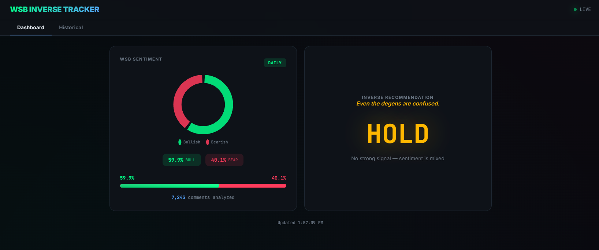

# WSB Inverse Sentiment Tracker

A real-time sentiment analysis tool that monitors r/wallstreetbets and recommends the **inverse** of whatever WSB is feeling. Because WSB is (almost) always wrong.

Runs on an Orange Pi Zero 2 and serves a dashboard on your local network.



## How It Works

1. **Polls Reddit every 60 seconds** — fetches comments from the active WSB discussion thread (daily, overnight, or weekend) plus the top 10 hot posts and their comments
2. **Analyzes sentiment** using a three-layer system:
   - `sentiment` NLP library for full-sentence analysis
   - 40+ WSB-specific phrase patterns (context-aware, e.g. "my puts about to rip" = bearish)
   - Emoji scoring (rocket, bear, diamond hands, etc.)
3. **Recommends the inverse** — if WSB is bullish, it says PUTS. If bearish, CALLS. With entertaining taglines.

## Dashboard

- Real-time bullish vs bearish pie chart (neutral excluded)
- Animated sentiment bar
- CALLS / PUTS / HOLD recommendation with glowing neon UI
- 90-day historical sentiment trend
- Inverse strategy accuracy tracking (once SPY data is integrated)

## Tech Stack

- **Runtime:** Node.js 20+ with TypeScript
- **Database:** SQLite via better-sqlite3 (WAL mode)
- **Web:** Express 5 serving a Chart.js dashboard
- **Reddit:** Public JSON API (no auth required)
- **Sentiment:** `sentiment` npm library + custom WSB lexicon

## Prerequisites

- Node.js 20+
- npm
- Git

## Installation

```bash
# Clone the repo
git clone https://github.com/supercrossed/wsb.git
cd wsb

# Install dependencies
npm install

# Build
npm run build

# Run
npm start
```

The dashboard will be available at `http://localhost:3000`.

## Development

```bash
# Run in dev mode with hot reload
npm run dev

# Type check
npm run typecheck
```

## Deploy to Orange Pi

SSH into your Pi and run:

```bash
# Clone the repo
git clone https://github.com/supercrossed/wsb.git
cd wsb

# Install dependencies
npm install --omit=dev

# Build
npm run build

# Run the setup script (creates systemd service + auto-updater)
bash scripts/setup-pi.sh
```

This will:
- Create a `wsb` systemd service that auto-starts on boot
- Create a timer that checks GitHub for updates every 5 minutes
- Auto-rebuild and restart the service when new commits are pushed

### Useful Commands

```bash
# Check service status
sudo systemctl status wsb

# View live logs
journalctl -u wsb -f

# Check updater timer
sudo systemctl list-timers wsb-updater.timer

# Manually restart
sudo systemctl restart wsb
```

## Project Structure

```
src/
  api/routes.ts          # Express API endpoints
  config/index.ts        # Environment config
  lib/                   # Logger, error classes
  services/
    database.ts          # SQLite schema, queries, purge logic
    reddit.ts            # Reddit public API fetching
    scheduler.ts         # 60s poll loop, top posts, sentiment aggregation
    sentiment.ts         # NLP + emoji + WSB phrase analysis
  types/index.ts         # TypeScript interfaces
  server.ts              # Express server
  index.ts               # Entry point
public/
  index.html             # Dashboard UI
scripts/
  setup-pi.sh            # Orange Pi deployment script
```

## Data Retention

- **Comments:** 2 days (enough for overnight thread analysis)
- **Daily sentiment:** 90 days (dashboard history)
- **Historical records:** Forever (inverse strategy accuracy tracking)
- **Top posts:** 2 days

## Thread Schedule (EST)

| Thread | Active Period |
|--------|--------------|
| Daily Discussion | 7:00 AM - 3:59 PM weekdays |
| What Are Your Moves Tomorrow | 4:00 PM - 6:59 AM weekdays |
| Weekend Discussion | Friday 4:00 PM - Monday 6:59 AM |

## Future

- SPY price integration for accuracy tracking
- Alpaca-based 0DTE options trading bot
